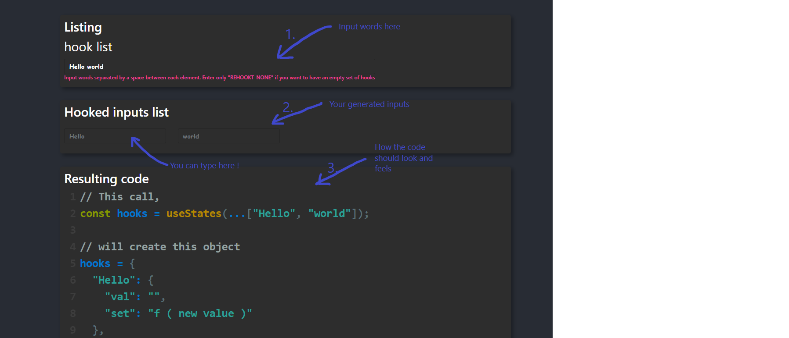

# Demo version

## install
Once you cloned Rehookt, keep only the demo folder.
open a terminal into the `demo` folder. And run:
```bash
$ npm install
```

## Run it
```bash
# will open the local web page on http://localhost:3000
$ npm run start
```

## Have fun

With this demo you will be able to analyse behaviors upon generating hooks. If something is wrong you will be hinted by an error box. Or if not, you will see what hooks will resulted from your inputs. 

Open this [page](http://localhost:3000/?redirect=%2F%3F%26listing%3DHello%20world) into the browser or perform the same *with style* from the terminal.

```bash
# [Windows]
$ start http://localhost:3000/?redirect=%2F%3F%26listing%3DHello%20world

# [Unix]
$ xdg-open http://localhost:3000/?redirect=%2F%3F%26listing%3DHello%20world

# [Mac]
$ open http://localhost:3000/?redirect=%2F%3F%26listing%3DHello%20world
```
